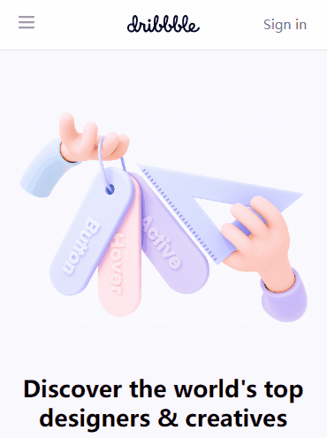

# Elubrazione's Dribbble
- 一个简易版的 `Dribbble` 页面，无依赖外部框架或样式库，使用媒体查询和Grid、Flex实现响应式布局。

## 目录
- [Elubrazione's Dribbble](#elubraziones-dribbble)
  - [目录](#目录)
  - [要求清单](#要求清单)
  - [效果总览](#效果总览)
  - [完成思路](#完成思路)
  - [问题及解决方式](#问题及解决方式)

## 要求清单
- `task-375w` ：页面宽度 `375px` 时，顶部导航菜单折叠了起来，并且固定在顶部，内容区域采用单列布局。
- `task-menu-375w` ：折叠菜单展开时，出现一个遮罩遮住整个页面
- `task-768w` ：页面宽度 `768px` 时，导航菜单依旧是折叠的，下面的banner和内容区域变成了两列布局。
- `task-920w` ：页面宽度 `920px` 时，导航菜单平铺，并且不再固定在顶部，下方内容依然是两列布局
- `task-1366w` ：页面宽度 `1366px` 时，banner和下方列表占据全部的水平空间，两侧留有固定的内边距。
- `task-1920w` ：页面宽度 `1920px` 时，banner区域已经变成固定宽度，列表区域依然占据全部水平空间，两侧留有固定的内边距。
- `task-hover`：平铺的导航菜单鼠标悬停时有改变颜色。

## 效果总览

**1. task-375w**

**2. task-menu-375w**

**3. task-768w**

**4. task-920w**

**5. task-1366w**

**6. task-1920w**

**7. task-hover**
菜单鼠标悬停时改变颜色，效果已在 `task-920w` 中展示。

**8. 过渡效果总览**

## 完成思路
1. 完成task.json数据文件的导入、页面DOM节点创建JS函数；
2. 完成 `task-375w` 的初始html界面：header、banner、footer，调整好基础的CSS样式；
3. 完成 `task-menu-375w` 中的html页面和CSS样式，编写对应的DOM节点增删操作代码，绑定页面监听事件；
4. 完成 `task-768w`，编写媒体查询设置断点改变对应的CSS；
5. 完成 `task-920w`，因为从920w开始导航菜单平铺，所以要重新编写菜单栏渲染函数；同时修改 `window.onload()` 函数，在Load菜单时判断当前页面的宽度，Load不同的菜单栏；剩下的就是编写媒体查询设置断点改变对应的CSS；
6. 完成 `task-1366w`，编写媒体查询设置断点改变对应的CSS；
7. 完成 `task-1920w`，编写媒体查询设置断点改变对应的CSS；
8. 完成 `task-hover`，编写媒体查询设置断点改变对应的CSS。

## 问题及解决方式